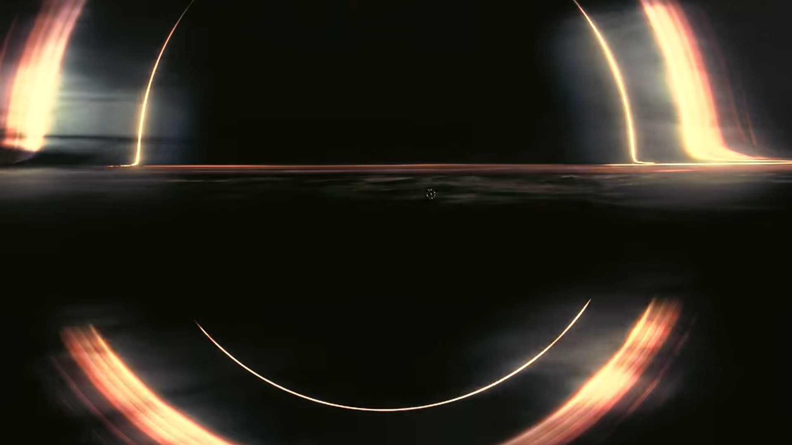
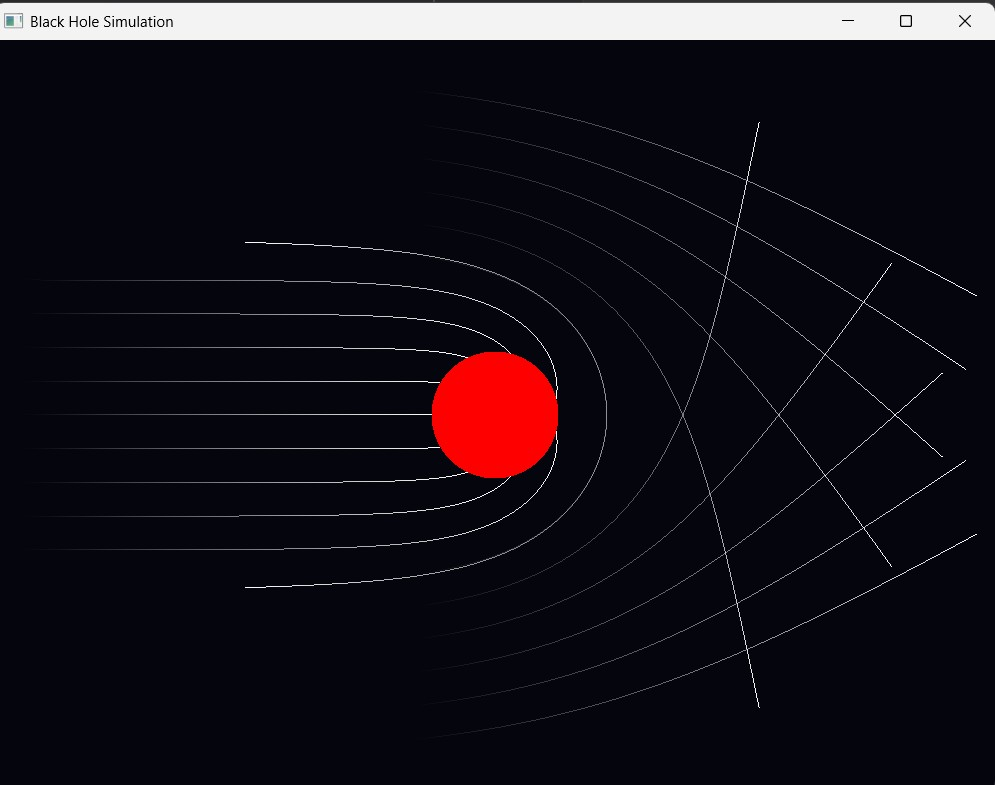
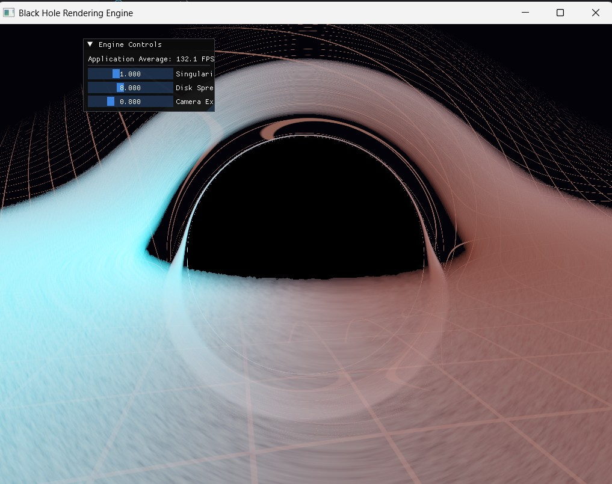

<div id="top"></div>

<div align="center">

[](https://github.com/D3vanshUSha4mA/BlackHole-Simulation/graphs/contributors)
[](https://github.com/D3vanshUSha4mA/BlackHole-Simulation/network/members)
[](https://github.com/D3vanshUSha4mA/BlackHole-Simulation/stargazers)
[](https://github.com/D3vanshUSha4mA/BlackHole-Simulation/issues)
[](https://github.com/D3vanshUSha4mA/BlackHole-Simulation/blob/main/LICENSE)

</div>

<br />

<div align="center">

# GPU-Accelerated Relativistic Black Hole Engine

### Real-Time Black Hole Rendering using C++, OpenGL & GLSL

*A physically-inspired rendering engine simulating gravitational lensing, photon trajectories, volumetric plasma, and relativistic Doppler effects using GPU raymarching.*

<br>

<!-- ================= HERO IMAGE ================= -->



*(Replace with your best rendered image or GIF.)*

</div>

---

## Table of Contents

- [About The Project](#about-the-project)
- [Features](#features)
- [Development Journey](#development-journey)
- [Physics & Mathematics](#physics--mathematics)
- [Project Structure](#project-structure)
- [Screenshots](#screenshots)
- [Performance](#performance)
- [Getting Started](#getting-started)
- [Controls](#controls)
- [Future Improvements](#future-improvements)
- [License](#license)

---

# About The Project

Rendering a convincing black hole requires significantly more than drawing a black sphere.

Light rays passing near a massive object bend due to spacetime curvature. Simulating this effect means tracing millions of photons while continuously integrating their trajectories under gravity.

This project is a custom rendering engine written entirely in **C++**, **OpenGL**, and **GLSL**, implementing physically-inspired black hole rendering techniques including:

- Gravitational lensing
- Event horizon capture
- GPU raymarching
- Volumetric accretion disk
- Relativistic Doppler shifting
- Adaptive numerical integration

The engine began as a simple CPU-based 2D prototype and gradually evolved into a real-time GPU renderer capable of maintaining **144+ FPS**.

---

# Features

## Rendering

- GPU accelerated raymarching
- Real-time rendering
- HDR lighting
- Physically-inspired black hole visualization
- Dynamic camera movement

## Physics

- Schwarzschild gravitational lensing
- RK4 photon trajectory integration
- Adaptive integration step size
- Photon capture by the event horizon

## Volumetric Rendering

- 3D procedural plasma
- Fractal Brownian Motion (FBM)
- Beer-Lambert absorption
- Emission and scattering

## Relativity

- Relativistic Doppler shift
- Relativistic beaming
- Redshift & Blueshift
- Orbiting plasma simulation

## Engine

- Modern OpenGL 3.3
- GLSL Fragment Shader pipeline
- Dear ImGui integration
- CMake build system

---

# Development Journey

The project was developed in three major stages.

---

## Stage 1 — 2D Prototype

The first milestone focused only on validating the mathematical model.

Instead of rendering a complete scene, photons were traced inside a 2D plane around a black hole.

Implemented:

- RK4 Integration
- Schwarzschild lensing
- Photon capture
- Event horizon

This stage ensured that the physics behaved correctly before introducing an additional spatial dimension.

---

## Stage 2 — CPU-Based 3D Renderer

After validating the mathematics, the renderer was extended into three dimensions.

New additions included:

- Spherical coordinates
- 3D camera
- Flat accretion disk
- Skybox sampling

Although visually successful, every ray was computed sequentially on the CPU.

Performance:

- approximately **0.5 FPS**

This stage highlighted the need for GPU acceleration.

---

## Stage 3 — GPU Accelerated Renderer

The entire rendering pipeline was rewritten inside GLSL Fragment Shaders.

Instead of tracing photons on the CPU, every screen pixel launches its own photon ray on the GPU.

New features include:

- Massive parallel execution
- Adaptive raymarching
- Volumetric plasma
- Beer-Lambert integration
- Doppler beaming
- Dear ImGui controls

Performance now scales to monitor refresh rate.

Typical FPS:

- **144+ FPS**

---

# Physics & Mathematics

## 1. Schwarzschild Spacetime

Photons travel along curved trajectories inside the Schwarzschild metric.

The engine integrates the trajectory using fourth-order Runge-Kutta.

Acceleration:

```math
a=-1.5\,r_s\,\frac{L^2}{r^5}\,p
```

where

- \(r_s\) = Schwarzschild radius
- \(L\) = angular momentum
- \(r\) = radial distance

---

## 2. Runge-Kutta (RK4)

Photon motion is integrated using RK4 because it offers significantly better stability than Euler integration.

Advantages:

- High numerical accuracy
- Stable trajectories
- Low accumulated error

---

## 3. Beer-Lambert Law

The accretion disk is modeled as a participating medium.

Light intensity decreases according to

```math
I = I_0 e^{-\tau}
```

where

- \(I_0\) = initial intensity
- \(\tau\) = accumulated optical depth

The renderer terminates rays once opacity becomes sufficiently high.

---

## 4. Fractal Brownian Motion

Instead of a flat colored disk, procedural FBM generates turbulent plasma density.

This produces:

- swirling gas
- turbulence
- natural density variation

without using textures.

---

## 5. Relativistic Doppler Effect

Gas orbiting near the event horizon approaches relativistic speeds.

Each sample computes the Doppler factor.

This produces:

- blueshift
- redshift
- relativistic brightness

The emitted light intensity scales approximately with

```math
D^3
```

creating the characteristic bright side of the accretion disk.

---

# Project Structure

```
RelativisticBlackHole/

│
├── assets/
│
├── shaders/
│
├── src/
│   ├── core/
│   ├── renderer/
│   ├── physics/
│   ├── ui/
│   └── main.cpp
│
├── external/
│
├── CMakeLists.txt
│
└── README.md
```

---

# Screenshots

## 2D Prototype


<p align="center">



</p>

---

## Final GPU Renderer


<p align="center">



</p>

---

# Performance

| Version | Renderer | FPS |
|----------|----------|-----|
| Prototype 2D | CPU | High |
| Prototype 3D | CPU | ~0.5 FPS |
| Final Renderer | GPU (GLSL) | 144+ FPS |

---

# Getting Started

## Prerequisites

- C++17
- CMake ≥ 3.10
- OpenGL 3.3
- GLFW
- GLAD
- Dear ImGui

---

## Clone Repository

```bash
git clone https://github.com/yourusername/RelativisticBlackHole.git
```

---

## Build

```bash
mkdir build

cd build

cmake ..

cmake --build .
```

For MinGW:

```bash
cmake -G "MinGW Makefiles" ..

cmake --build .
```

---

## Run

```bash
./prototype_3d_gpu
```

Windows:

```bash
prototype_3d_gpu.exe
```

---

# Controls

| Key | Action |
|------|--------|
| W A S D | Move Camera |
| Mouse | Look Around |
| Shift | Faster Movement |
| Esc | Exit |
| ImGui Panel | Modify simulation parameters |

---

# Future Improvements

Planned features include:

- Kerr (rotating) black holes
- Gravitational redshift
- Bloom pipeline
- HDR rendering
- Temporal Anti-Aliasing
- Multiple black holes
- Binary black hole simulations
- Physically-based sky model
- Vulkan renderer
- Compute shader implementation

---

# License

Distributed under the MIT License.

See `LICENSE` for more information.

---

<div align="center">

**Built with**

C++ • OpenGL • GLSL • GLFW • GLAD • Dear ImGui • CMake

</div>

---

<!-- MARKDOWN LINKS -->

[contributors-shield]: https://img.shields.io/github/contributors/yourusername/RelativisticBlackHole.svg?style=for-the-badge
[forks-shield]: https://img.shields.io/github/forks/yourusername/RelativisticBlackHole.svg?style=for-the-badge
[stars-shield]: https://img.shields.io/github/stars/yourusername/RelativisticBlackHole.svg?style=for-the-badge
[issues-shield]: https://img.shields.io/github/issues/yourusername/RelativisticBlackHole.svg?style=for-the-badge
[license-shield]: https://img.shields.io/github/license/yourusername/RelativisticBlackHole.svg?style=for-the-badge